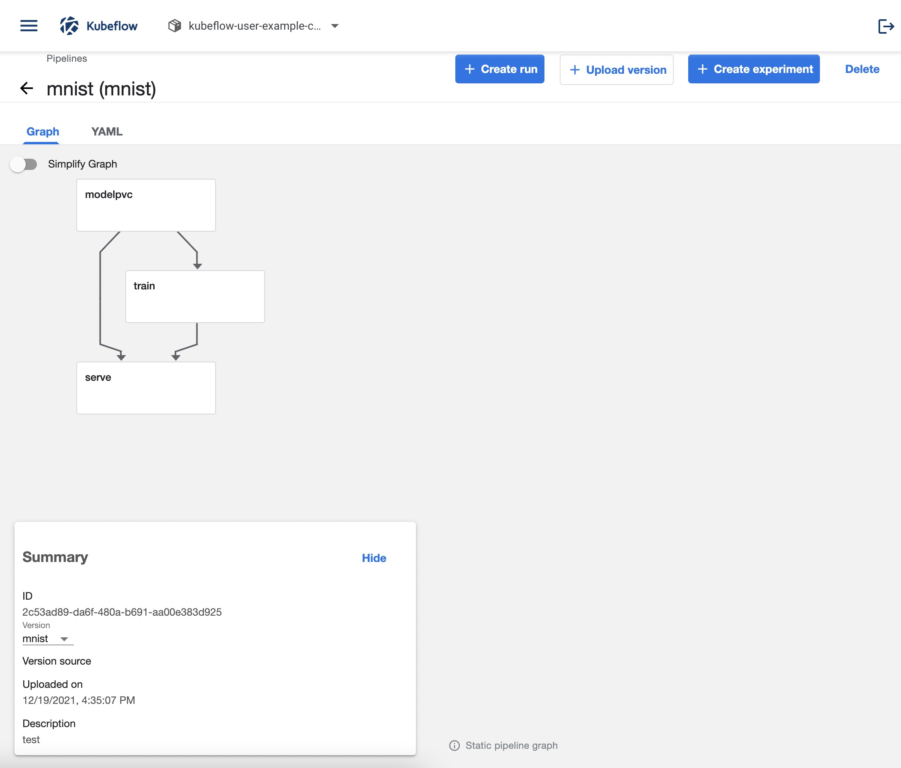
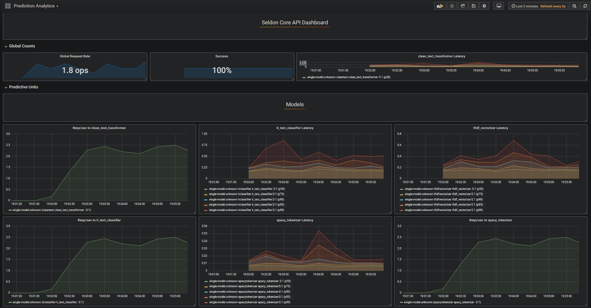

# Kubeflow

Kubeflow addon provides the all-in-one Kubeflow installation. It's based on [kubeflow/manifests](https://github.com/kubeflow/manifests).

## Install

### Ensure default StorageClass exists

First check if you cluster has default StorageClass:

```
kubectl get storageclass
```

This is what it looks on AlibabaCloud:

```
NAME                                PROVISIONER                       RECLAIMPOLICY   VOLUMEBINDINGMODE      ALLOWVOLUMEEXPANSION   AGE
alicloud-disk-available (default)   diskplugin.csi.alibabacloud.com   Delete          Immediate              true                   21h
alicloud-disk-efficiency            diskplugin.csi.alibabacloud.com   Delete          Immediate              true                   21h
```

If it doesn't, patch the following annotation to your storage class:

```
kubectl patch storageclass <your-storageclass> -p '{"metadata": {"annotations":{"storageclass.kubernetes.io/is-default-class":"true"}}}'
```

### Install Kubeflow Addon

Install it via CLI:

```
vela addon enable kubeflow
```

Or you can enable it via UI.


## Verify

After it is installed, run:

```
kubectl port-forward svc/istio-ingressgateway -n istio-system 8080:80
```

Then access `http://localhost:8080/`, you will see:


## Upload an example pipeline

Save the following as `app.yaml`:

```yaml
apiVersion: core.oam.dev/v1beta1
kind: Application
metadata:
  name: test-kfp
spec:
  components:
    - name: sequential-example
      type: upload-kfp
      properties:
        image: acr.kubevela.net/oamdev/kubeflow-tool
        outputDir: /data/kubeflow/
        outputName: sequential.tar.gz
        buildScript: |-
          #!/usr/bin/bash
          set -ex

          PIPELINE_URL=https://raw.githubusercontent.com/kubeflow/pipelines/master/samples/core/sequential/sequential.py
          wget -O sequential.py ${PIPELINE_URL}
          dsl-compile --py sequential.py --output /data/kubeflow/sequential.tar.gz
```

Run:

```
kubectl apply -f app.yaml
```

It will automatically downloads the [`sequential.py` sample pipeline](https://github.com/kubeflow/pipelines/blob/master/samples/core/sequential/sequential.py),
and builds and uploads it to Kubeflow Pipelines service:


## Build and run MNIST pipeline

In this example we will:

- create a PVC to store and serve the model
- create a TFJob to train the model
- create a SeldonDeployment to serve the model

The code is available [here](https://github.com/hongchaodeng/pipelines/blob/master/samples/contrib/seldon/mnist_tf_volume.py).

Save the following as `app.yaml`:

```yaml
apiVersion: core.oam.dev/v1beta1
kind: Application
metadata:
  name: test-kfp
spec:
  components:
    - name: mnist-example
      type: upload-kfp
      properties:
        image: acr.kubevela.net/oamdev/kubeflow-mnist
        outputDir: /data/kubeflow/
        outputName: mnist-train-serve.tar.gz
        buildScript: |-
          #!/usr/bin/bash
          set -ex

          wget https://raw.githubusercontent.com/hongchaodeng/pipelines/master/samples/contrib/seldon/mnist_tf_volume.py
          dsl-compile --py mnist_tf_volume.py --output /data/kubeflow/mnist_tf_volume.tar.gz
```

Run:

```
kubectl apply -f app.yaml
```

The pipeline will be uploaded automatically. Check it out:



Once the pipeline is run and finished, you will have a full end-to-end training and production workload.
You can check out the SeldonDeployment analytics:





## Train and serve MNIST model

In above example we showed how to build a pipeline to train and serve MNIST model.
Here we will show a higher level API to train and serve MNIST model by abstracting away pipeline details.


Save the following as `app.yaml`:


```yaml
apiVersion: core.oam.dev/v1beta1
kind: Application
metadata:
  name: test-kfp
spec:
  components:
    - name: train-serve-mnist-example
      type: train-serve-mnist
      properties:
        pvc:
          size: 20Gi # 50Mi is enough on kind cluster
        train:
          image: seldonio/deepmnistclassifier_trainer:0.3
        serve:
          image: seldonio/deepmnistclassifier_runtime:0.3
        
```

Run:

```
kubectl apply -f app.yaml
```

You should be able to see the pipeline being run and check the SeldonDeployment analytics.
